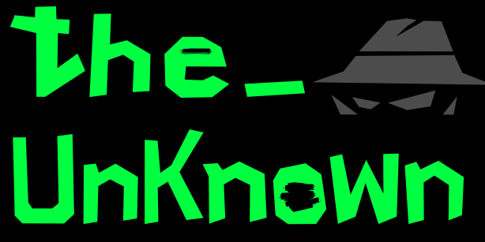

## The_Unknown


The_Unknown is an open-source Python terminal narrative engine and interactive fiction framework.

Create branching stories, dialogue-driven adventures, mystery games, visual novel style experiences, or entirely custom text-based projects using simple JSON narrative files.

The project includes a starter narrative called **Origin**, but the engine is designed to support entirely custom narratives without modifying the core Python code.

## Features:
  
  - Create branching narratives using simple JSON files with minimal programming knowledge

  - Dynamic Interactions: Player choices influence story progression, dialogue, and narrative outcomes

  - Persistent Progress


## Save System and File Creation

To ensure your privacy and security, this program follows a strict file-access policy.

  **Standard**: The engine stores save files in each story's save directory. If a valid save is found for the current narrative, progress can be loaded.

  **File Creation**: If no save file or directory exists, the game will automatically create the required files and folders.

## Prerequisites
Before installing, ensure you have the following installed on your system
- **Python 3.12.3 and up** (Recommended)
- **Git** (To clone the repository)

## Installation & Usage

  1. Clone the repository:
```Bash
git clone https://github.com/Data-Rogue/the_unknown.git
```
  2. Navigate to the folder:
```Bash
cd the_unknown
```

  3. Run the game:
```Bash
python3 the_unknown.py
```

## Story writing
 - See [story_writing.md](development/story_writing.md)

## Privacy Disclaimer

This project only reads from and writes to its designated save directory. It does not modify unrelated files on your system or transmit data externally.
You are encouraged to review the source code to verify its behavior firsthand.

## License
This project is licensed under the MIT [License](LICENSE)

***Created by Hazmat Harry***

```Text
      ___    ___     ___    ___  _____    ,
     /  /   /  /    |   |  |   |/ ____\  /B
    /  /___/  /     |   |__|   | | n n |//
   /__ ___ __/      B    __    | |_____|/
   \  \   \  \      |   |  |   | o  U o|      /|/|
    \__\   \__\     |   |  |   |   ____|-_-_-/ | |
    /__/   /__/    /_____\/_____\______________|_|
```


